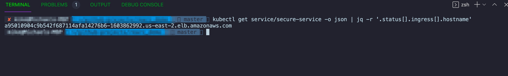

### EKS Cluster Rearc Demo ###

## Prerequisits ## 

* An AWS account with CLI access to the account 
* An ACM cert - it's ARN is necessary in the yaml of the [demo-app.yaml](https://github.com/hitekhippy/rearc_demo/blob/master/cluster_resources/demo-app.yaml#L7)
* A existing a repo where you can pull the image from. It's needed [here](https://github.com/hitekhippy/rearc_demo/blob/master/cluster_resources/demo-app.yaml#L32)

## Dependencies ## 
  | Dependency | Version | Notes | Required | 
  | ------------- | ------------- | --- | --- |
  | terraform  | 0.14.8   | This will be handled by tfenv if you have it installed | Yes | 
  | kubectl | 1.18.2 | | Yes | 
  | awscli | 2.1.5 | | Yes | 
  | jq | 1.6 | Not a strict requirement, but ease of use thing | No | 

## Usage ## 

# Deploying the infrastructure # 

Pretty striaght foward just need to `terraform init` then `terraform apply`. 

After the apply is complete (this will take some time, quite a few resources are generated) you can run the below command to automatically update your kubeconfig with the newly created EKS cluster config to allow you to access the cluster. 
`aws eks --region $(terraform output region | jq -r) update-kubeconfig --name $(terraform output cluster_name | jq -r)` 

Check to see if you can see your new cluster using the awscli `aws eks list-clusters`. 

# Deploy the image. # 

The `cluster_resource` directory holds yaml files for K8's resources inside the cluster E.G deployments/daemonsets etc. *NOTE* You'll need to insert your own ACM/IAM cert (the annotation will accept either) and image into the demo-app.yml image field near the bottom. 

Move into the ./cluster_resource/ directory and run `kubectl apply -f demo-app.yaml` 

# Validation #
Run `kubectl get service/secure-service -o json | jq -r '.status[].ingress[].hostname'`

The output of the command is where navigate to with https:// appended , it's the DNS record of a LoadBalancer so for e.g; 

This would lead you to https://a95010904c9b542f687114afa14276b6-1603862992.us-east-2.elb.amazonaws.com